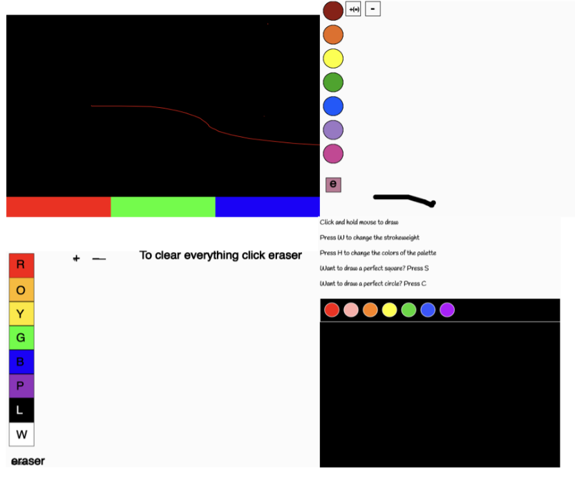

# Paint in p5

**GOAL**: Create an application that allows users to paint on a canvas with various colors, stroke widths, and erasers. 

Your final project should:
- Create a program that allows you to draw with the mouse.
- Create at least 4 buttons that will control different aspects of the program, such as color changes.
- Create at least 4 key press reactions that will control different aspects of the program, such as brush type.
- Make sure the user understands how to use your program!

Stuck? [Check out this example!](https://paint-in-p5-exemplar.stevenlance.repl.co/
)